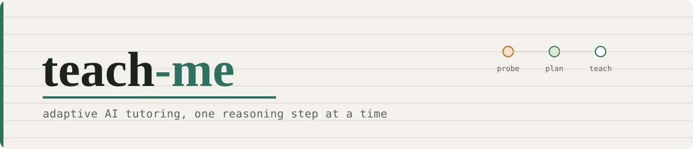
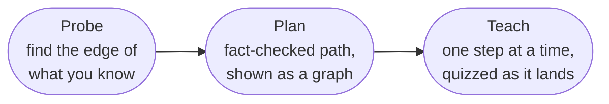
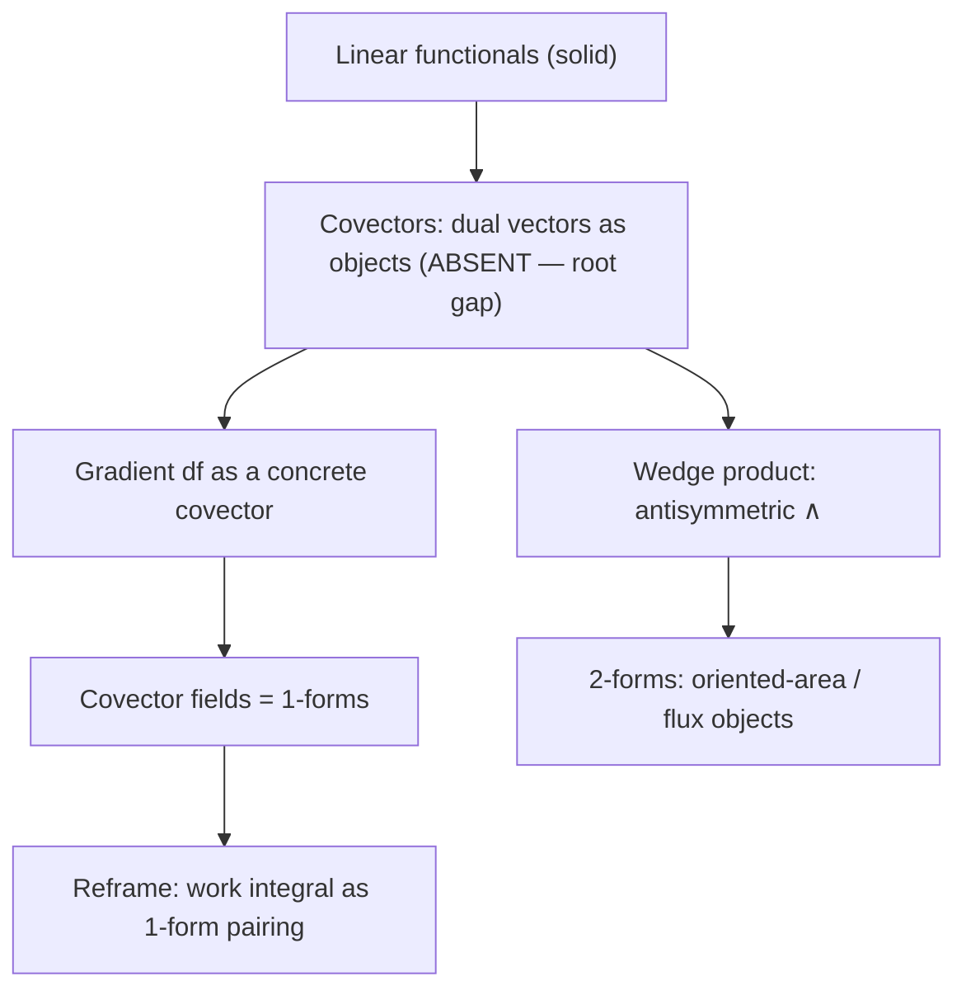

<picture>
  <source media="(prefers-color-scheme: dark)" srcset="assets/banner-dark.svg">
  
</picture>

<div align="center">

[](LICENSE)
[](https://claude.com/claude-code)
[](https://youtu.be/kzcI5F4tGiU)

</div>

A Claude Code skill that turns Claude into a one-on-one adaptive tutor for any topic. It measures exactly what you already know, plans a teaching path around that specific gap, and then teaches it one idea at a time with real comprehension checks — instead of dumping a generic explanation on you the way a chat window normally does.

```
/teach-me differential forms
```

---

## Why

Normal learning is many-to-many: one book/course/teacher serves many students, so it can't be tuned to any one of them, and one student pulls from many sources, each with its own notation, style, and a trust cost your brain re-pays every time.

The fix isn't more resources — it's collapsing both directions to one-to-one: a single tutor that knows exactly where your understanding currently ends, and puts all the *logistics* of learning (sourcing, sequencing, fact-checking, pacing) on itself instead of on you, so the only thing you have to struggle with is the actual material.

## What it does

`/teach-me <topic>` runs three phases, in order, every time:



A later `/teach-me` on the same topic reads the log and resumes teaching from wherever the graph was left, instead of starting the whole pipeline over.

| Phase | What happens |
|---|---|
| **Probe** | Multiple-choice binary-searches the edge of your understanding on every concept the topic depends on — answer what you know and it skips ahead, answer wrong or "I don't know" and it narrows in. Each question set is built by a dedicated `mc-writer` subagent that mutates the correct claim into real, diagnostic-but-fair wrong answers and audits the finished set blind before it's shown to you, so the correct option is never guessable from its shape alone. But a correct multiple-choice pick is never the final word: once it lands on your edge, it confirms with a free-response question ("explain how you'd approach this," not "pick the right box"), because recognizing the right answer and being able to produce it are different skills, and MC alone lets a guess pass as understanding. |
| **Plan** | Reasons out a teaching path from your current understanding to your goal, fact-checks it with a separate `fact-checker` subagent before committing, tiers each concept as core (the goal actually depends on it) or peripheral (helpful context) so depth gets spent where it's earned, and shows the result as a dependency graph. Before you ever see it, a separate `plan-critic` subagent — fresh context, no stake in the graph looking finished — independently re-checks that every node traces to real evidence and that the tiering holds up, catching exactly the kind of invented completeness an author tends to miss in its own work. |
| **Teach** | Walks the graph one reasoning step at a time — never bundling multiple new ideas into one message — dispatches a `diagram-maker` subagent when a visual would help (it renders the diagram and actually looks at the result before handing it back, never a diagram that's merely written and trusted), and checks comprehension in a mix of formats: multiple-choice for a quick fact, free-response for anything that tests actual reasoning, or a real interactive dashboard (rendered math, a graded question, a live code editor with instant test feedback) when the check is dense enough that chat text alone would strain — built by an `interactive-check-builder` subagent that renders and clicks through it before it's ever published, and submitting one notifies the session directly, no polling. A concept only gets marked mastered once it's been applied to something new, not just recognized or re-explained back verbatim. Anything wrong or hollow-sounding gets retaught a different way, not just corrected and left behind. Before starting each new concept, it pauses and hands you the floor for any question that a quiz wouldn't have surfaced — and you can jump in with one anytime, not just at that checkpoint. |

Everything is written to a persistent markdown log per topic as it happens, so you can reopen it later (Obsidian renders it live, LaTeX included), and a later `/teach-me` on the same topic resumes from exactly where you left off instead of re-probing from scratch.

## Example

A real excerpt from a session teaching differential forms to a learner who already knew standard vector calculus but had never seen a covector. This is unedited output, not a mockup.

<details>
<summary><strong>Probe →</strong> locating the edge of understanding</summary>

> **Q:** A dual vector / covector / linear functional on `V` is best described as...
> - **A.** A function `V → ℝ` that's linear: `f(av+bw) = af(v)+bf(w)` ✅ *(correct)*
> - B. A vector flipped to point opposite
> - C. Just another name for the dot product
> - D. Never heard this term
>
> **Answer: D.** Absent — narrow.
>
> **Q:** If `f(v)` returns a number with `f(av+bw) = af(v)+bf(w)`, do you recognize this property?
> - **A.** Yes, that's linearity, comfortable with it ✅ *(correct)*
> - B. That's continuity
> - C. Only makes sense if `f` is a matrix
> - D. Don't know this either
>
> **Answer: A**, confident. **Edge located:** linearity is solid; packaging linear functionals as their own object is genuinely absent — this becomes the session's root teaching gap.

</details>

<details>
<summary><strong>Plan →</strong> a gated dependency graph, not an improvised outline</summary>



Every node here traces to a probe result, a front-loaded claim, or an explicit one-line reasoning note — nothing is on the graph just to make it look complete.

</details>

<details>
<summary><strong>Teach →</strong> one step, then a real check before moving on</summary>

> A covector on `V` is a function `α: V → ℝ` that's linear. The picture that makes this concrete: instead of drawing `α` as an arrow, draw it as a **stack of evenly-spaced parallel lines** — given a vector `v`, `α(v)` is the number of lines `v` pierces. A vector is a thing being measured; a covector is the measuring device itself.
>
> **Quiz:** `α` applied to `u` vs. `2u` (same direction, double length) — what's the relationship between `α(u)` and `α(2u)`?
> - **A.** `α(2u) = 2·α(u)` ✅ *(correct — linearity)*
> - B. `α(2u) = α(u)`, covectors only care about direction
> - C. `α(2u) = α(u)²`
> - D. No fixed relationship
>
> **Answer: A.** Correct — node solid, on to the next step.

</details>

A fresh critic later compared this session blind against the source video's own differential-forms demo, on probe quality, plan rigor, pacing, quiz follow-through, and whether any of the work fell on the learner instead of the material. It preferred this session on all five.

## Install

```
git clone <this repo> teach-me && cd teach-me && ./install.sh
```

`install.sh` links (or, where a real link isn't available, copies) this repo into `~/.claude/skills/teach-me` and each subagent under `agents/` (`diagram-maker`, `fact-checker`, `plan-critic`, `interactive-check-builder`, `mc-writer`) into its own file under `~/.claude/agents/`, then installs the diagram renderer's native dependency (Puppeteer, which bundles its own headless Chromium — a one-time ~250MB download; it's not committed to the repo). It prefers a real symlink so that pulling updates or editing the repo takes effect immediately with nothing to resync; where the OS/filesystem won't allow one it falls back to a plain copy and tells you so — in that case, re-run `./install.sh` after pulling changes. Safe to re-run any time.

Restart Claude Code (or start a new session) and `/teach-me` will be available.

Doing it by hand instead of running the script: copy `SKILL.md` and `assets/` into `~/.claude/skills/teach-me/`, and every file under `agents/` into `~/.claude/agents/` (same filenames), then `cd ~/.claude/skills/teach-me/assets/visualize && npm install`.

## Use

```
/teach-me differential forms
/teach-me how transformers do attention
/teach-me                      # it'll ask what you want to learn and your goal
```

Before probing starts, you can front-load anything you already know solidly — that skips the corresponding questions instead of asking you to sit through them.

If you invoke `/teach-me` again on a topic you've already started, it reads the existing log, re-checks only the shakiest recent nodes, and resumes teaching from where it left off.

## Requirements

- Claude Code, with the `AskUserQuestion` and `Agent` (subagent) tools available — both are standard.
- Node.js, for `install.sh`'s one-time Puppeteer/Chromium download and for the `diagram-maker` and `interactive-check-builder` subagents' renderers.
- For interactive checks specifically (dense math, code-writing challenges): the Artifact tool with the `artifact` runtime capability, i.e. Claude Code with Artifacts publishing enabled. Without it, the skill falls back to plain chat questions rather than a dashboard — it never claims a check happened through the interactive layer when it didn't.
- Nothing paid. No MCP server, no external API, no third-party account.

**Built for Claude Code specifically, not portable as-is.** The probe/plan/teach philosophy and the pedagogical rules (the distractor-writing procedure, MC-then-free-response, depth tiering) are plain prose and would carry over fine to any assistant you can hand a long system prompt to — GitHub Copilot included. The *mechanics* this repo actually runs on won't: `AskUserQuestion`'s structured multi-choice UI, the `Agent` tool's subagent dispatch (what `diagram-maker` runs as), and the Artifact tool's publish/watch/notify loop the interactive checks depend on are all Claude Code/claude.ai-specific — there's no Copilot equivalent to translate them onto. A Copilot version would mean rebuilding the interactive layer against whatever Copilot actually exposes, not copying files over.

## Notes and known limitations

- The quiz mechanic has been exercised against a scripted learner persona during development, not yet against a large sample of real, unpredictable answers — expect to file sharp edges as you actually use it.
- `diagram-maker` renders locally (Puppeteer + a bundled Chromium, installed by `install.sh`) — no fallback path, no external rendering service, so a diagram either gets rendered and looked at or the subagent says plainly it couldn't and skips it.
- The interactive-check template (`assets/interactive-check/`) is self-hosted (its own bundled KaTeX, no CDN calls at runtime), has been exercised live end-to-end (submit → notify → grade), and has since been visually verified with real screenshots (the same local Puppeteer install `diagram-maker` uses, pointed at the built HTML directly). That pass caught a real bug worth knowing about if you're modifying the template: `render()` fully replaces `#app`'s innerHTML on every interaction, which wipes out KaTeX's rendered spans and puts raw `$...$` source back on screen — so `renderMathInElement` has to be called at the end of every `render()`, not once at load. It's fixed now, but it's exactly the kind of bug `verify.py`'s structural checks can't catch (the page loaded fine, looked fine on first paint, and only broke after the first click) — if you change how state changes reach the DOM, re-screenshot and click through it, don't just re-run `verify.py`.
- `assets/visualize`'s `npm audit` currently flags 4 high-severity issues, all in Puppeteer's transitive `extract-zip` (a symlink path-traversal bug that only fires once, extracting Chromium from Google's own CDN at install time — not exposed to anything at render time). Left unpatched rather than force a breaking Puppeteer major bump that risks the mermaid-cli dependency; revisit if that chain gets a real patch release.
- The skill deliberately doesn't prescribe a teaching voice or personality — it optimizes for pacing, rigor, and correctness, and leaves style up to you to specify if you care about it.

## Credits

> Based on the process described in [this video](https://youtu.be/kzcI5F4tGiU) by **Eero Alvar** — all credit for the original probe/plan/teach philosophy goes to him.

This repo is an independent reimplementation of that process for Claude Code's actual tools, plus a few extensions of its own: session resuming, mixed multiple-choice/free-response checks that gate mastery on transfer rather than a lucky pick, per-node discussion pauses, depth tiering by how load-bearing a concept actually is, wrong-answer reteaching, and an end-of-session review queue.

## License

MIT — see [LICENSE](LICENSE).
